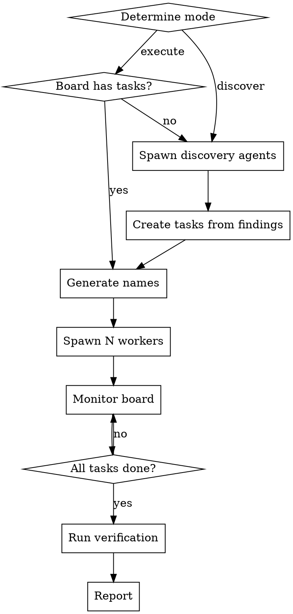

# Managed Team

Spin up a team of named agents that self-direct from a differ-review kanban board. You act as project manager.

## Modes

### Execute Board
Tasks already exist on the board. Spawn workers, they pull and complete tasks.

```
/managed-team execute
```

### Discover and Fix
No tasks yet. Spawn discovery agents (pentesters, quality reviewers), create tasks from findings, then spawn fixers.

```
/managed-team discover-and-fix
```

## Core Pattern



## Setup

### 1. Generate Names

```
mcp__differ-review__random_name()  # one per worker
```

### 2. Worker Prompt Template

Each worker gets this prompt (fill in name and constraints):

```
You are {NAME}, a fixer agent. Pick up tasks from the differ-review kanban board and fix them.

WORKFLOW:
1. mcp__differ-review__list_tasks(repo_path="{REPO}") to see pending tasks
2. Pick highest-priority pending task
3. mcp__differ-review__take_task(task_id=..., worker_name="{NAME}") to claim it
4. Do the work (read, fix, test)
5. mcp__differ-review__update_task(task_id=..., status="done", note="summary")
6. Go back to step 1

CONSTRAINTS:
{CONSTRAINTS}
```

### 3. Spawn Workers

```python
# 3-4 workers is the sweet spot. More causes contention.
Task(name=name, subagent_type="general-purpose", mode="bypassPermissions",
     team_name=team, prompt=worker_prompt)
```

## Project Manager Responsibilities

### Monitor
Check `mcp__differ-review__list_tasks` periodically to track progress.

### Create Tasks from Findings
When discovery agents report, create tasks with severity in title:
```
mcp__differ-review__create_task(repo_path=REPO, title="[HIGH] Fix X", description="...")
```

### Handle Stale Agents
If an agent goes idle without completing its task, send a nudge via SendMessage. If unresponsive after 2 nudges, shut down and respawn.

### Avoid Full Test Suite
Broadcast to workers: run only targeted tests relevant to their change. Full suite runs should be a separate task at the end.

## Discovery Agent Types

For discover-and-fix mode, spawn these as background agents:

| Type | Focus | Count |
|------|-------|-------|
| **Pentester** | Auth, access control, crypto, input validation | 2-3 |
| **Quality** | Code bugs, UX issues, performance | 1-2 |

Discovery agents report findings but do NOT fix. Their output becomes tasks.

## Constraints to Always Include

```
- Use {VENV_PATH} for all Python/pytest commands (if applicable)
- Do NOT use git stash
- Run only targeted tests, not the full suite
- Do NOT modify files outside your task scope
```

## Common Mistakes

| Mistake | Fix |
|---------|-----|
| Too many workers (5+) | Stick to 3-4. More causes file contention. |
| Workers run full test suite | Broadcast: targeted tests only. |
| Stale shutdown requests kill respawned agents | Use fresh names for respawns. |
| Workers duplicate each other's tasks | differ-review take_task prevents this. |
| No verification at end | Always run full test suite as final task. |
